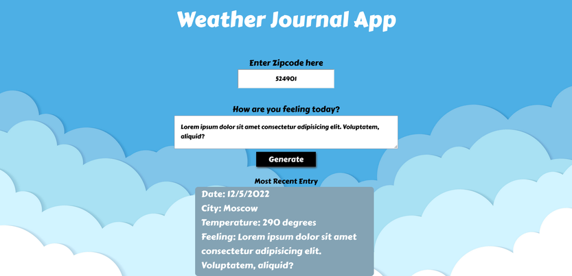

# Weather Journal App

Simple web app that when given any valid zip code tells you the current temperature at the location of that zip code using <a href="https://openweathermap.org/api">open weather map api</a>



## Dependencies

Node JS

```bash
https://nodejs.org/en/
```

## Installation

Clone the repository into any directory

```git
git clone https://github.com/Hazem-Mohamed200/Weather-Journal-App.git
```

## Usage

Navigate to the directory where you cloned the repository and run the following command from the terminal

```bash
node server.js
```

then from any web browser go to this link: http://localhost:8000/
or simply click <a href="http://localhost:8000/">HERE</a>
